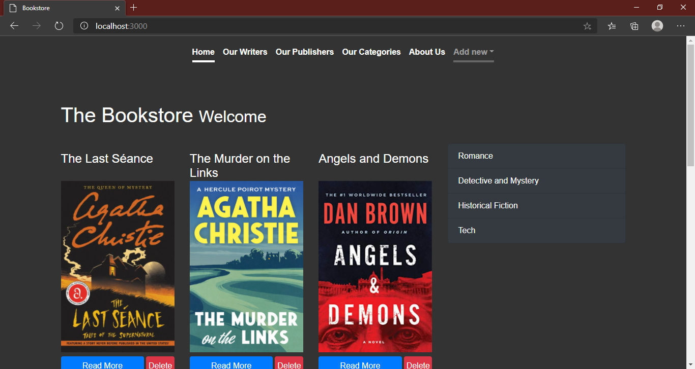
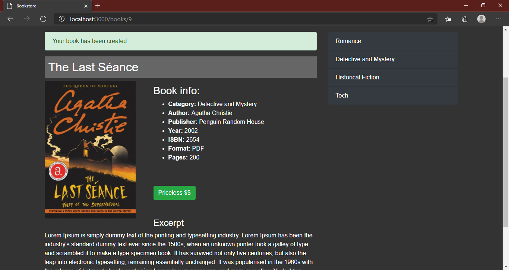
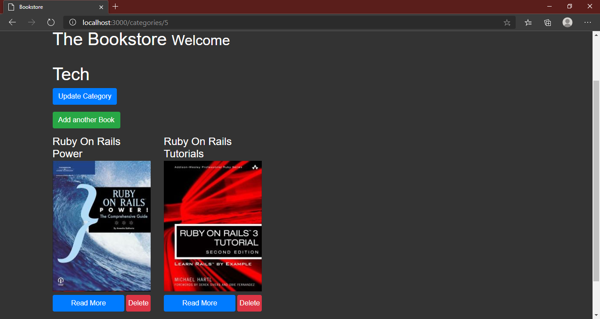
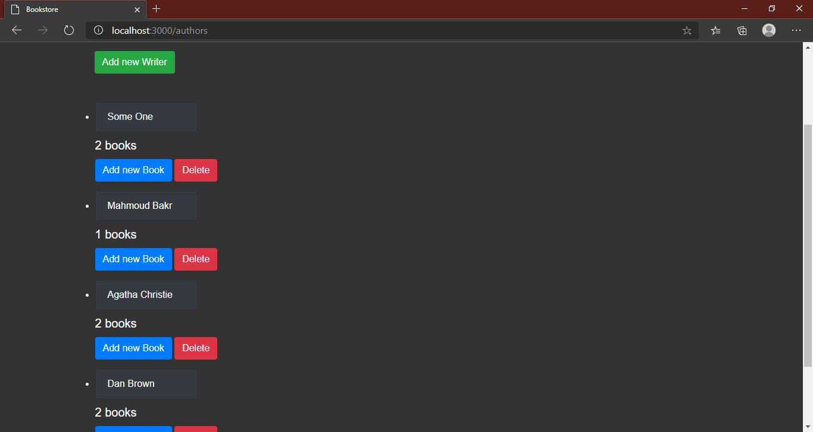

# Book Store
 
**BookStore rails application**

## Screenshots

## Built with

* Ruby 2.7.1p83
* Rails 5.2.4.4

## Live Link

* https://fathomless-crag-24679.herokuapp.com/

## Getting Started
* Clone the repo using this link https://github.com/MahmoudBakr23/Book-Store.git
* cd Book-Store
* Run the following comand lines in terminal:
* bundle install
* rails db:migrate
* rails s
* Then, go to localhost:3000 on your browser

## Authors

👤 **Mahmoud**

- Github: [@MahmoudBakr23](https://github.com/MahmoudBakr23)

- Linkedin: [Mahmoud Bakr](https://www.linkedin.com/in/m-bakr/)

- Email: [contact on Gmail](mbakr6821@gmail.com)

##    Contributing

Contributions, issues and feature requests are welcome!

## Show your support

Give a ⭐️ if you like this project!

## Acknowledgments

- Eduonix
- Brad Traversy
